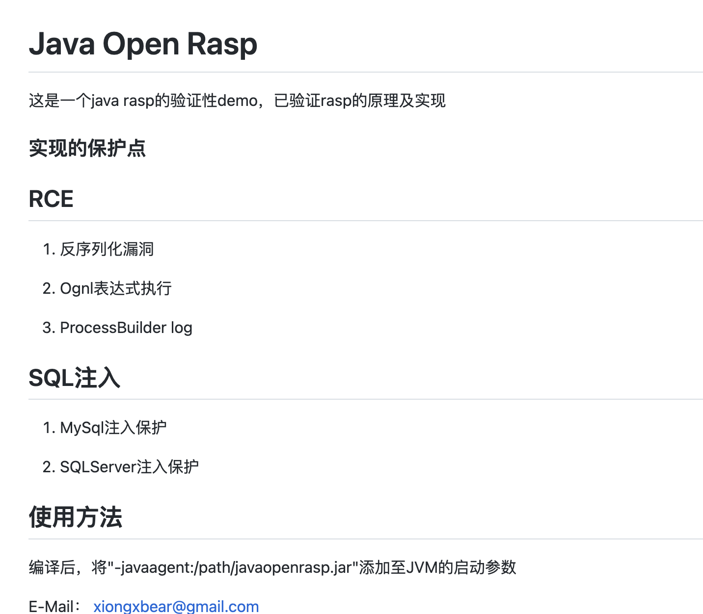
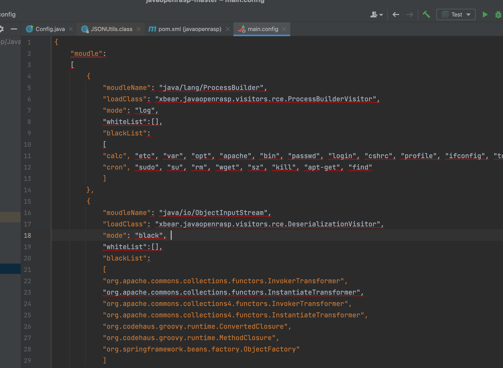
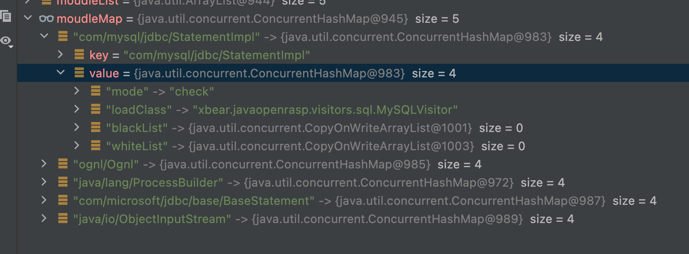
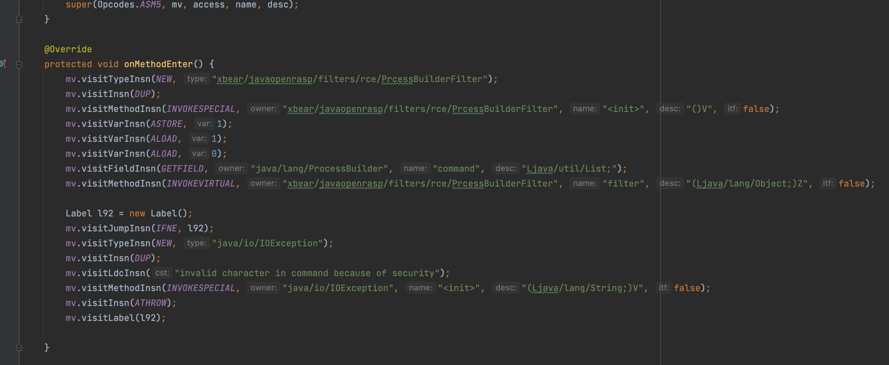
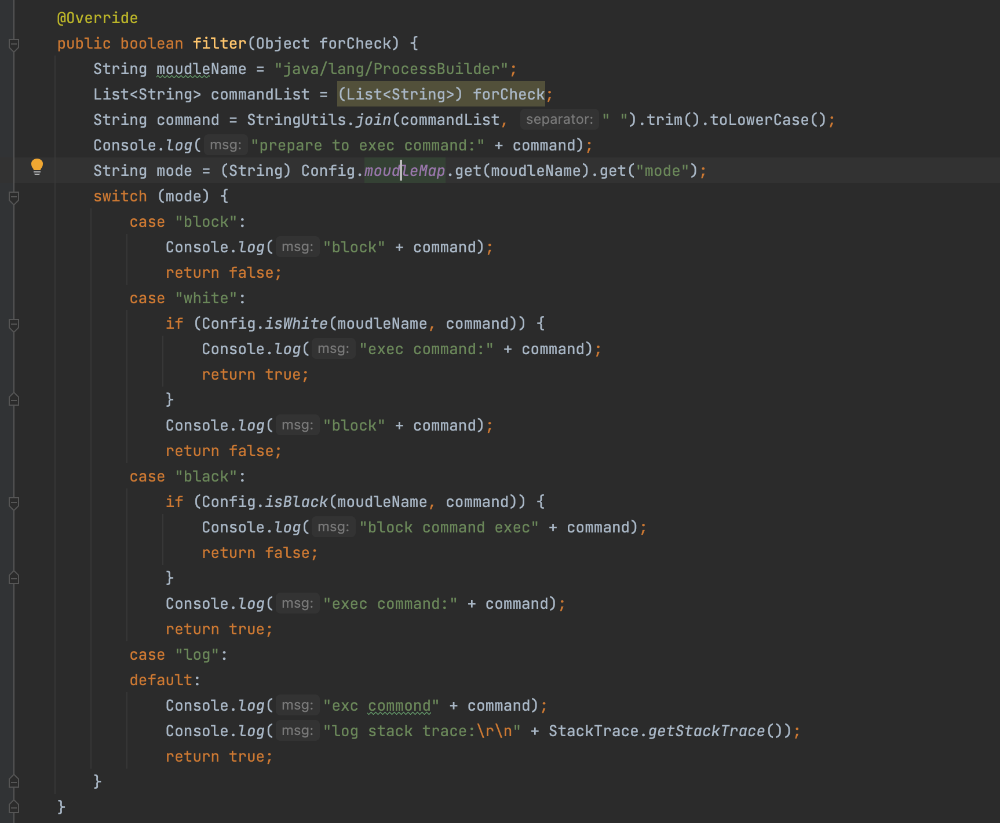

# xbeark-javaopenrasp源码阅读

## 项目地址

https://github.com/xbeark/javaopenrasp

## 简介

​	随便看了下，这个算是不太难，并且适合我这种初学者啰，简单看看ReadMe可以发现实现了一些基本功能，这里我们了解他的基本实现思路即可


## 阅读本项目用到的ASM相关前置知识

btw，只搞一些比较重要的点，首先我们知道在ASM CORE API当中有几个比较重要的点是ClassReader、ClassVisitor、ClassWriter以及AdviceAdapter，这里不会讲代码怎么写，只是告诉这是干嘛的便于对代码架构的理解

### ClassReader/ClassWriter

稍微不是那么重要一点，这里只说一下具体作用，它负责读取.class文件里的内容，然后拆分成各个不同的部分（其实就是与类文件的组成有关，这里对代码理解没意义）,ClassWriter也真是将拆分的部分重新组合


### ClassVisitor

ClassVisitor是访问者模式的逻辑

在ClassVisitor类当中，定义了多个visit开头的方法，这些方法的参数也与ClassFile结构密切相关。这些方法，遵循一定的调用顺序，来自官方文档

```java
visit
[visitSource][visitModule][visitNestHost][visitPermittedSubclass][visitOuterClass]
(
 visitAnnotation |
 visitTypeAnnotation |
 visitAttribute
)*
(
 visitNestMember |
 visitInnerClass |
 visitRecordComponent |
 visitField |
 visitMethod
)* 
visitEnd
```

当然这里有必要对其中一些东西做个简单说明

- `[]`: 表示最多调用一次，可以不调用，但最多调用一次
- `()`和`|`: 表示多个方法之间，可以选择任意一个，并且多个方法之间不分前后顺序
- `*`: 表示方法可以调用0次或多次


### AdviceAdapter

在AdviceAdapter类的方法中，定义了两个重要的方法：onMethodEnter()方法和onMethodExit()方法，顾名思义

- onMethodEnter：在方法进入时，添加一些代码逻辑
- onMethodExit：在方法退出时，添加一些代码逻辑

因此我们可以通过实现自定义AdviceAdapter，在方法体进入的部分(onMethodEnter)插入我们的拦截代码实现监控


ok大致扫盲了一遍，可以去深入阅读源码了

## 源码阅读正文

首先关注`xbear.javaopenrasp.Agent`，可以看见只实现了`premain`的方式，也就是启动前加载

```java
public class Agent {

    public static void premain(String agentArgs, Instrumentation inst)
            throws ClassNotFoundException, UnmodifiableClassException {
        Console.log("init");
        init();
        inst.addTransformer(new ClassTransformer());
    }

    private static boolean init() {
        Config.initConfig();
        return true;
    }
} 

```

### 配置初始化

删除了部分没必要的影响阅读的代码

```java
String configStr = readConfig("/main.config");
Map configMap = (Map) JSONUtils.parse(configStr);
List<Map> moudleList = (List<Map>) configMap.get("moudle");
for (Map m: moudleList) {
Map<String, Object> tmpMap = new ConcurrentHashMap<String, Object>();
tmpMap.put("loadClass", m.get("loadClass"));
tmpMap.put("mode", m.get("mode"));
tmpMap.put("whiteList", new CopyOnWriteArrayList<String>((Collection) m.get("whiteList")));
tmpMap.put("blackList", new CopyOnWriteArrayList<String>((Collection) m.get("blackList")));
moudleMap.put((String)m.get("moudleName"), tmpMap);
}
Console.log(moudleMap.toString());
```

首先是配置的初始化`init`,调用的是`xbear.javaopenrasp.config.Config#initConfig`，首先通过`readConfig`方法将配置文件内容读入，其实只是一个读文件的方法，之后会解析这个`main.config文件`，这个文件内容是符合json格式

之后将解析好的内容保存至List的结构当中，之后对这个list做二次处理将结果保存到moudleMap当中，其中key是需要监控的类，value是对应的一些其他配置参数，参数作用下面会详细说说



#### 配置文件参数浅析

```xml
moudleName：需要去监控的一些类
loadClass：指定对应要用到的ClassVisitor去做拦截或日志记录
mode：拦截模式，有log(只记录日志)，black(黑名单)，block(阻断)、check(检查判断)四种模式
whiteList：白名单
blackList：黑名单
```


### ClassTransformer

之后具体来看这个用户自己实现的类转换器，核心代码就那么几段，这里他会根据不同的类去执行不同的ClassVisitor方法

```java
ClassReader reader = new ClassReader(classfileBuffer);
ClassWriter writer = new ClassWriter(ClassWriter.COMPUTE_MAXS);
ClassVisitor visitor = Reflections.createVisitorIns((String) Config.moudleMap.get(className).get("loadClass"), writer, className);
reader.accept(visitor, ClassReader.EXPAND_FRAMES);
transformeredByteCode = writer.toByteArray();
//xxxxx省略很多代码
```

为了方便讲解我们这里用`ProcessBuilder`执行命令的流程来做讲解啰，它对应了`xbear.javaopenrasp.visitors.rce.ProcessBuilderVisitor`，看他的`visitMethod`方法，可以看出来会对start方法做处理，具体可以看看`ProcessBuilderVisitorAdapter`

```java
@Override
public MethodVisitor visitMethod(int access, String name, String desc,
                                 String signature, String[] exceptions) {
  MethodVisitor mv = super.visitMethod(access, name, desc, signature, exceptions);
  if ("start".equals(name) && "()Ljava/lang/Process;".equals(desc)) {
    mv = new ProcessBuilderVisitorAdapter(mv, access, name, desc);
  }
  return mv;
}
```



可以看出做了这样几件事情，实例化`PrcessBuilderFilter`类(btw才发现他单词打错了)，把`ProcessBuilder`的`command`变量传入作为`filter`方法的参数，可以看到对于命令执行这个rasp的默认配置只是记录了执行的命令以及一些调用栈的信息并没有做拦截，这里同样可以看到其他模式比如block直接拦截，white白名单模式，black黑名单模式，log日志记录



## 浅谈一些缺点

时间有限，暂时不想对这个做更多了解，主要是新人为了学习第一篇rasp做了解，首先是一些功能点的实现缺点，比如对于黑名单

```java
	public static boolean isBlack(String moudleName, String testStr) {
		List<String> blackList = (List<String>) moudleMap.get(moudleName).get("blackList");
		for (String black: blackList) {
			if (testStr.trim().toLowerCase().indexOf(black.trim().toLowerCase()) > -1) {
				return true;
			}
		}
		return false;
	}
```

可能在大部分场景下没问题的，但是既然是一个通用的类，那肯定有不通用的绕过点，比如对于Ognl表达式我们完全可以像这样去绕过这个简单的字符串查找

```
#this.getClass().forName("jav"+"a.lang.Runtime").getMethods[12].invoke(#this.getClass().forName("jav"+"a.lang.Runtime").getMethods[6].invoke(),"/tmp/aaa.sh")
```

## 参考文章

https://zhishihezi.net/b/5d644b6f81cbc9e40460fe7eea3c7925

http://wjlshare.com/archives/1582
